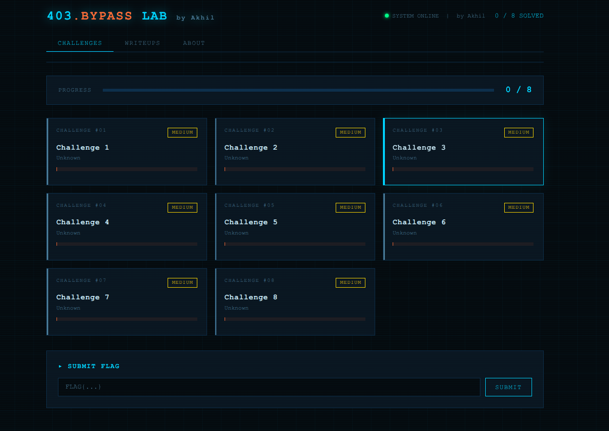

# 403 Bypass Lab

A self-contained Docker lab with 8 real-world 403 bypass challenges.

## Quick Start
### Option A: docker-compose (recommended)
```bash
docker-compose up --build
```
**OR**
### Option B: plain Docker
```
docker build -t 403lab .
docker run -p 3000:3000 403lab
```

Open **http://localhost:3000** in your browser.

## Preview

---

## Challenges

| # | Title                     | Technique                        | Difficulty |
|---|---------------------------|----------------------------------|------------|
| 1 | Internal Network Spoof    | X-Forwarded-For injection        | Easy       |
| 2 | WAF URL Rewrite           | X-Rewrite-URL header             | Easy       |
| 3 | Path Normalization        | URL encoding / dot segments      | Medium     |
| 4 | Method Override           | X-HTTP-Method-Override           | Medium     |
| 5 | X-Original-URL Smuggling  | X-Original-URL header            | Medium     |
| 6 | ACL Case Sensitivity      | Mixed-case path bypass           | Easy       |
| 7 | Slash Confusion           | Double slash / extra slash       | Hard       |
| 8 | Content-Type Smuggling    | Unusual Content-Type bypass      | Hard       |

## Solving

Each solved challenge returns a `FLAG{...}` token. Submit it in the UI to track progress. Writeups unlock per-challenge after solving.

## Recommended Tools

- `curl` (all challenges solvable from CLI)
- Burp Suite Repeater
- ffuf for path fuzzing (challenges 3, 6, 7)
